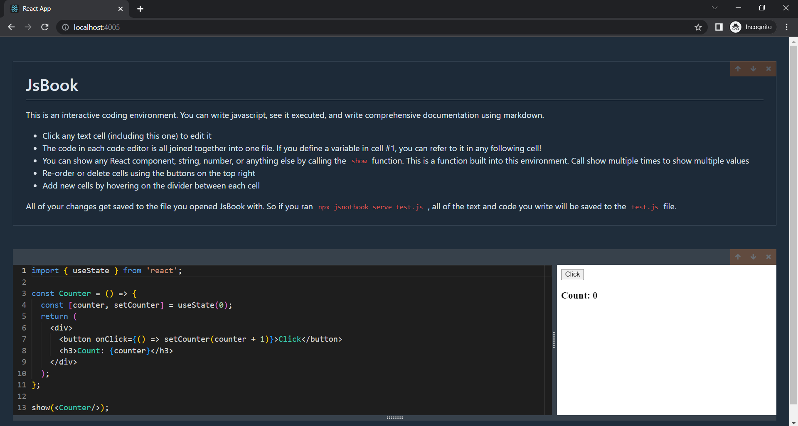

# JsBook

This is an interactive coding environment. You can write javascript, see it executed, and write comprehensive documentation using markdown.

- Click any text cell to edit it
- The code in each code editor is all joined together into one file. If you define a variable in cell #1, you can refer to it in any following cell!
- You can show any React component, string, number, or anything else by calling the `show` function. This is a function built into this environment. Call show multiple times to show multiple values
- Re-order or delete cells using the buttons on the top right
- Add new cells by hovering on the divider between each cell
- All of your changes get saved to the file you opened JsBook with. So if you ran `npx jsnotbook serve test.js` , all of the text and code you write will be saved to the `test.js` file.



## Tech Stack

**Client:** Typescript, React, Redux, Bulma, Esbuild

**Server:** Node, Express, Lerna

## Installation

```bash
npm install -g jsnotbook@latest
```

## Usage

```bash
jsnotbook serve [filename/path-to-file] [--port=<number>]

Examples: jsnotbook serve test.js --port=3000 jsnotbook -p 3000 test.js

Default filename is notebook.js, default port is 4005

or:

npx jsnotbook serve

jsnotbook --help

```
